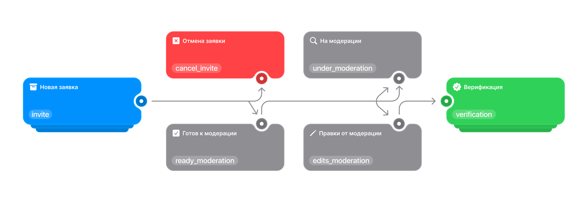

# Статус верификации компании
Система отслеживания процесса регистрации и проверки компаний в сервисе **appoint** использует последовательную модель статусов. Каждый статус отражает этап пути мерчанта — от подачи заявки до успешной публикации в каталоге.



**Поле статуса принимает значения:**

```json
status_verification: "invite" | "cancel_invite" | "ready_moderation" | "under_moderation" | "edits_moderation" | "verification"
```

---

## Триггеры смены статуса
- `invite` → `ready_moderation` — решение администратора после первичной проверки.
- `ready_moderation` → `under_moderation` — кнопка «Отправить на модерацию».
- `under_moderation` → `edits_moderation` — модератор нашёл ошибки.
- `edits_moderation` → `under_moderation` — повторная отправка.
- `under_moderation` → `verification` — успешное подтверждение данных.

---

## Новая заявка — `invite`
**Первичная регистрация мерчанта.**  
Мерчант проходит онбординг, заполняет базовые данные и отправляет заявку.

**На этом этапе:**
- Ожидается контакт администратора **appoint**.
- Идёт первичная проверка условий и данных.
- Доступ к модерации ещё закрыт.

**Переходы:**
- → `cancel_invite` — отклонение заявки администратором.
- → `ready_moderation` — заявка одобрена и можно приступать к заполнению профиля.

---

## Отмена заявки — `cancel_invite`
**Архивный статус.**  
Запрос мерчанта отклонён по причине несоответствия критериям, отсутствия связи или отказа от сотрудничества.

:::tip Уведомление на почту
Мерчант получает письмо с причиной отказа.
:::

**Переходы:**  
— отсутствуют (финальный статус).

---

## Готов к модерации — `ready_moderation`
**Подготовительный этап.**  
Администратор подтвердил заявку и договор. Мерчант может заполнить профиль компании.

**На этом этапе:**
- Разблокирован доступ к формам данных компании.
- Требуется внести реквизиты, описание, документы, изображения.
- Статус меняется только после отправки на модерацию.

:::tip Уведомление на почту
Мерчант получает письмо об изменении статуса и доступе к заполнению профиля.
:::

---

## На модерации — `under_moderation`
**Мерчант заполнил данные и отправил их на проверку.**

**На этом этапе:**
- Администратор проверяет корректность и достоверность данных.
- Редактирование профиля временно недоступно.

**Переходы:**
- → `verification` — данные успешно проверены.
- → `edits_moderation` — найдены ошибки, требуется доработка.

---

## Проверка от модерации — `edits_moderation`
**Статус возврата на доработку.**  
Администратор выявил ошибки, недостатки или несоответствия.

**На этом этапе:**
- Мерчанту предоставляются комментарии и инструкции по исправлению.
- Формы вновь доступны для редактирования.
- После исправления данные отправляются на проверку повторно.

:::tip Уведомление на почту
Мерчант получает письмо с комментариями администратора и ссылкой на редактирование.
:::

**Переходы:**
- → `under_moderation` — повторная отправка данных.

---

## Верификация — `verification`
**Финальный рабочий статус.**  
Компания успешно прошла проверку и опубликована в каталоге **appoint**.

**На этом этапе:**
- Компания становится видимой в каталоге.
- Разблокирован весь функционал личного кабинета.

:::tip Уведомление на почту
Мерчант получает письмо об успешной верификации.
:::

**Переходы:**  
— отсутствуют (финальный активный статус).