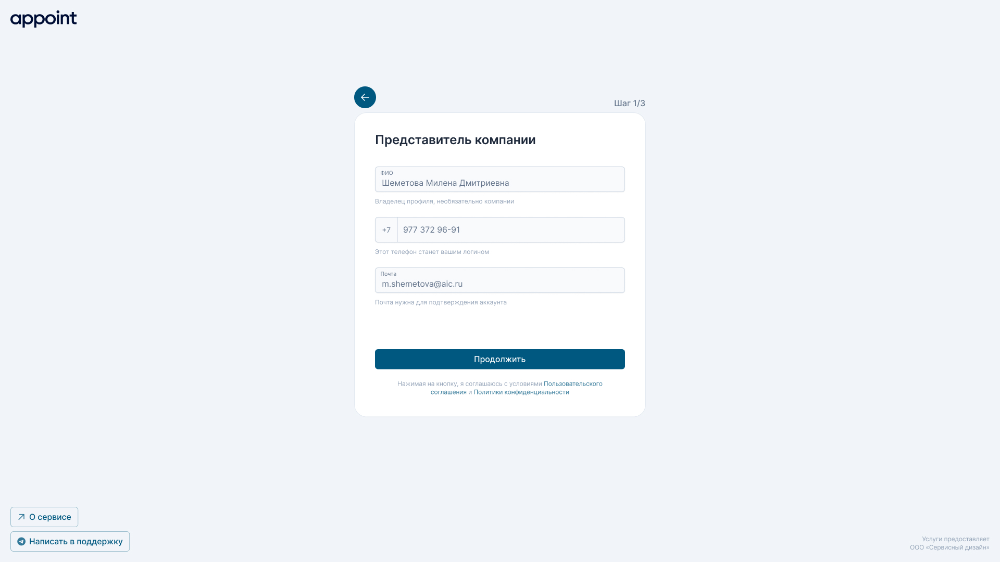
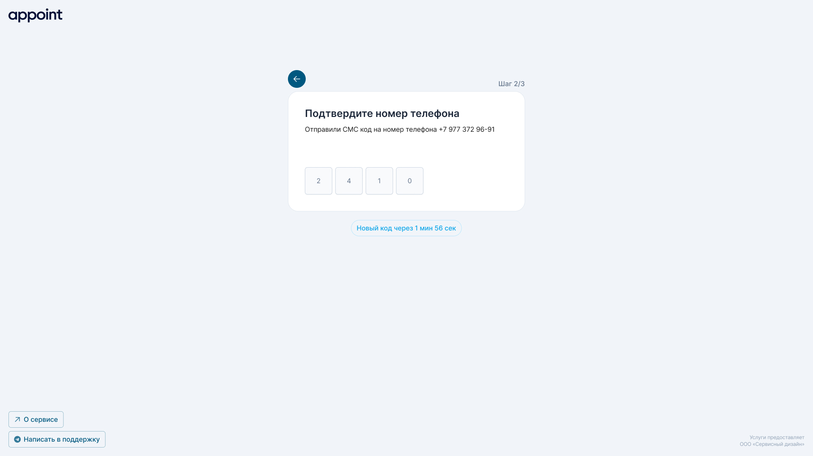
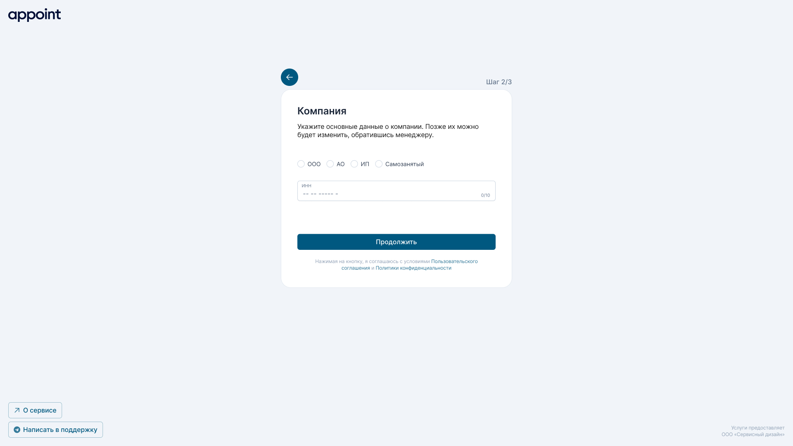
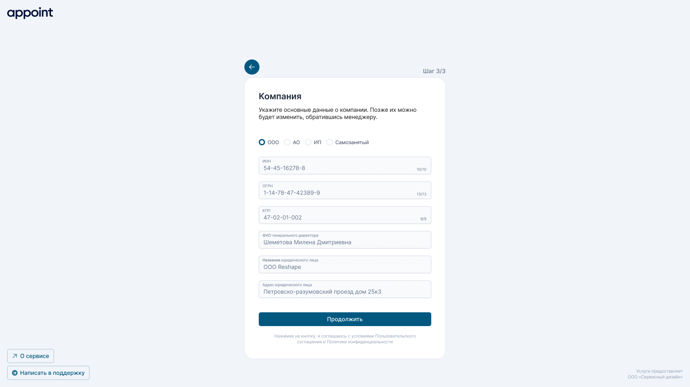
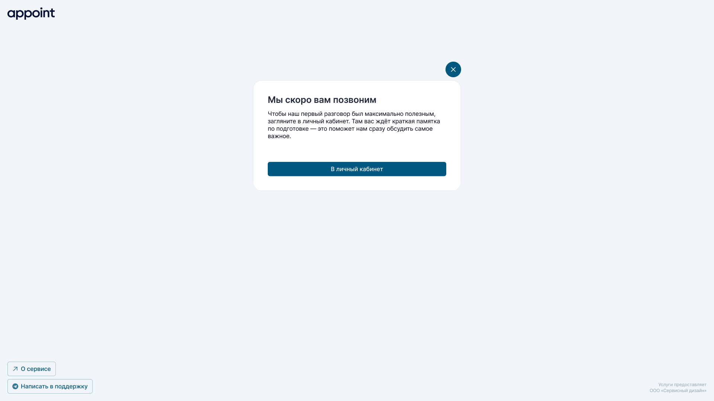

# Заявка на подключение
**Заявка на подключение** — это первый шаг в процессе регистрации нового мерчанта в appoint. На данном этапе мы собираем контактные сведения представителя бренда и основные юридические данные компании или индивидуального предпринимателя. Собранная информация используется для последующей модерации, проверки надёжности бренда и организации коммуникации с представителем.

**Процесс заполнения заявки разделён на два шага:**
1. Данные представителя бренда
2. Юридические данные бренда

*Такое разделение позволяет упростить ввод данных, повысить качество заполнения и обеспечить корректную первичную идентификацию мерчанта.*

---

## Базовый создания заявки

### Шаг 1 — Данные представителя бренда

На первом шаге мерчант предоставляет контактные данные представителя. Все поля формы являются обязательными для заполнения. После ввода информации пользователь должен подтвердить номер телефона — это обязательное условие для перехода к следующему шагу.

**Процесс подтверждения телефона:**
1. Пользователь вводит номер телефона.
2. На указанный номер отправляется SMS-код.
3. Пользователь вводит полученный код в соответствующее поле.
4. После успешной проверки номер считается подтверждённым, и пользователь может продолжить заполнение заявки.
   

**Получаемые данные:**
- ФИО
- Телефон (обязательное подтверждение через SMS-код)
- Электронная почта

> **Электронная почта на данном этапе не подтверждается.**
Подтверждение e-mail выполняется позднее — в личном кабинете, в разделе «Настройки пользователя». *После подтверждения электронной почты мерчант получает возможность авторизовываться по e-mail, получая код подтверждения.*

---

### Шаг 2 — Юридические данные бренда
На втором шаге пользователь вводит юридическую информацию, необходимую для проверки легитимности и существования компании. Форма работает динамически и адаптируется под выбранный тип юридического лица *(ООО, ИП или иной формат, поддерживаемый системой).*

Все поля являются обязательными для заполнения, а требования к форматам и правилам проверки значений описаны в отдельном документе:
[Правила валидации данных](/docs/Система/Валидация/Валидация%20регистрационных%20данных.md)

**Особенности работы формы на этом шаге:**
1. Изначально отображаются только два поля:
    - Тип юр. лица
    - ИНН
    

2. После ввода ИНН система обращается к сервису **DeData** для получения данных о юридическом лице:
    - Если DeData находит информацию о компании, соответствующие поля формы предзаполняются доступными данными. Пользователь может их отредактировать при необходимости.
    - Если DeData не находит информацию о компании, форма показывает пустые поля для ручного ввода данных.
    

### Завершение заявки и статусный экран
После заполнения второго шага и успешной отправки формы, пользователь переходит на статусный экран с сообщением о том, что заявка успешно отправлена.

**Поведение системы:**
1. Заявка направляется на модерацию в сервис appoint.
2. Администратор сервиса проверяет предоставленные данные и связывается с мерчантом для уточнений или подтверждения информации.
3. На этом этапе мерчант видит информацию о текущем статусе заявки и ориентировочные сроки рассмотрения.

> **Важно:** На данном этапе мерчант не может редактировать заявку. Для внесения изменений необходимо дождаться ответа администратора.

## Use Case