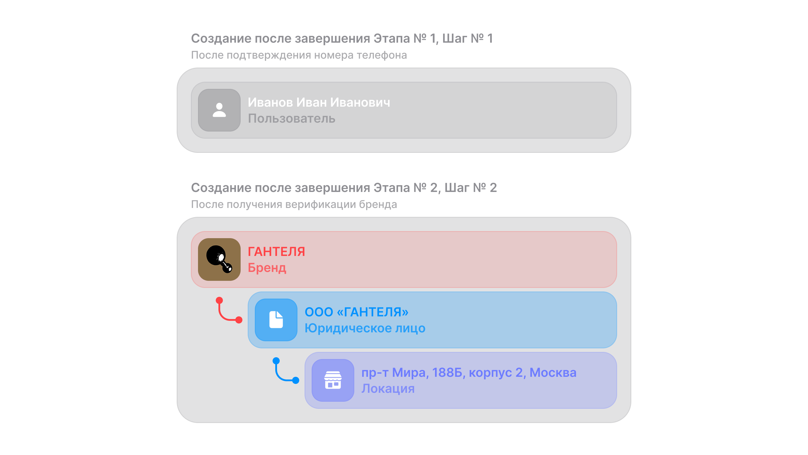

# Регистрация
Страница регистрации в **appoint** является ключевой точкой входа для новых мерчантов и играет важную роль в формировании качественного партнёрского пула. Процесс подключения намеренно структурирован в два последовательных шага, что позволяет нам обеспечить высокий уровень контроля, тщательно проверять предоставляемую информацию и гарантировать соответствие мерчантов внутренним требованиям сервиса.

Регистрационный сценарий разработан таким образом, чтобы снизить нагрузку на мерчантов, предоставить прозрачные ожидания и обеспечить плавный онбординг без потери качества. Каждый шаг проходит собственный цикл модерации, а решение по заявке формируется на основании заранее определённых критериев.

## Этапы регистрации:
- Этап № 1 – [**Заявка на подключение appoint**](./Заявка%20на%20подключение%20appoint.md)
    На этом этапе мерчант инициирует процесс подключения, заполняя базовый набор данных о себе и своём бизнесе.

    > ***Цель этапа** — получить первичную информацию, оценить соответствие компании правилам платформы и убедиться, что мерчант подходит под профиль нашего сервиса.*

    ---

- Этап № 2 – [**Заявка на создание бренда**](./Создание%20бренда.md)
    После успешного прохождения первичной проверки мерчант переходит к  заполнению подробной информации о своём бренде и локации.

    > ***Цель этапа** — этап направлен на оформление профиля мерчанта и оценку визуального качества, честности и прозрачности бренда.*

---

## Регистрация через интеграцию
- Этап №1 – [**Заявка на подключение через YCLIENTS**](./Заявка%20на%20подключение%20YCLIENTS.md)
    Подключение сервиса appoint через YCLIENTS позволяет мерчанту быстро создать заявку на регистрацию, используя уже существующие данные в системе YCLIENTS.

    ---
- Этап №1 – [**Заявка на подключение через 1С:Фитнес**](./Заявка%20на%20подключение%201С:Фитнес.md)
    Отправка быстрой заявки на подключение appoint из интерфейса 1С:Фитнес с минимальным набором контактных данных